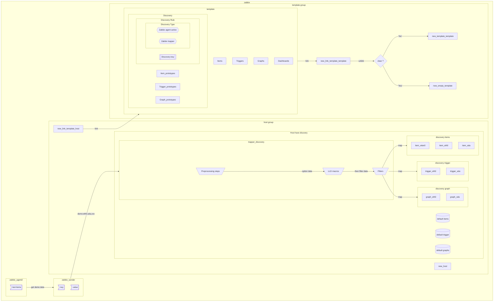

<!--  -->
# flowchart

```mermaid
flowchart TB
    subgraph zabbix
        subgraph zabbix_agent2
            test_key>test items]
        end
        subgraph zabbix_sender
            send_item>key]
            send_data>value]
        end
        subgraph template group
            subgraph template
                Items
                Triggers
                Graphs
                Dashboards
                subgraph Discovery 
                    Item_prototypes
                    Trigger_prototypes
                    Graph_prototypes
                    subgraph Discovery Rule
                        Dis_key[[Discovery key]]
                        subgraph Discovery Type
                            id_active{{Zabbix agent active}}
                            id_trapper{{Zabbix trapper}}
                        end
                    end
                end
            end
            new_link_template_template
            template --"link"--> new_link_template_template
            new_link_template_template --"unlink"--> unlink{clear ?}
            unlink --'No'--> new_template_template
            unlink --'Yes'--> new_empty_template
        end
        subgraph host group
            new_host
            new_link_template_host
            new_link_template_host --link--> template
            subgraph hostall [Host have discoery]
                ha_oi[(default items)]
                ha_ot[(default trigger)]
                ha_og[(default graphs)]
                subgraph ger_items [discovery items]
                    item_wlan0
                    item_eth0
                    item_sda
                end
                subgraph ger_trigger [discovery trigger]
                    trigger_eth0
                    trigger_sda
                end
                subgraph ger_graph [discovery graph]
                    graph_eth0
                    graph_sda
                end
                subgraph trapper_discovery
                    h_d_p[\Preprocessing steps/] 
                    h_d_lm[\LLD macros/]
                    h_d_f[\Filters/]
                    h_d_p --"opiton data"-->h_d_lm
                    h_d_lm --"then filter data"-->h_d_f
                end
                h_d_f --"map"-->ger_items
                h_d_f --"map"-->ger_trigger
                h_d_f --"map"-->ger_graph
            end
        end
        zabbix_sender --"demo:eth0,sda,xxx"-->trapper_discovery
        zabbix_agent2 --"get demo data"-->zabbix_sender
    end
    
```
<!--  -->